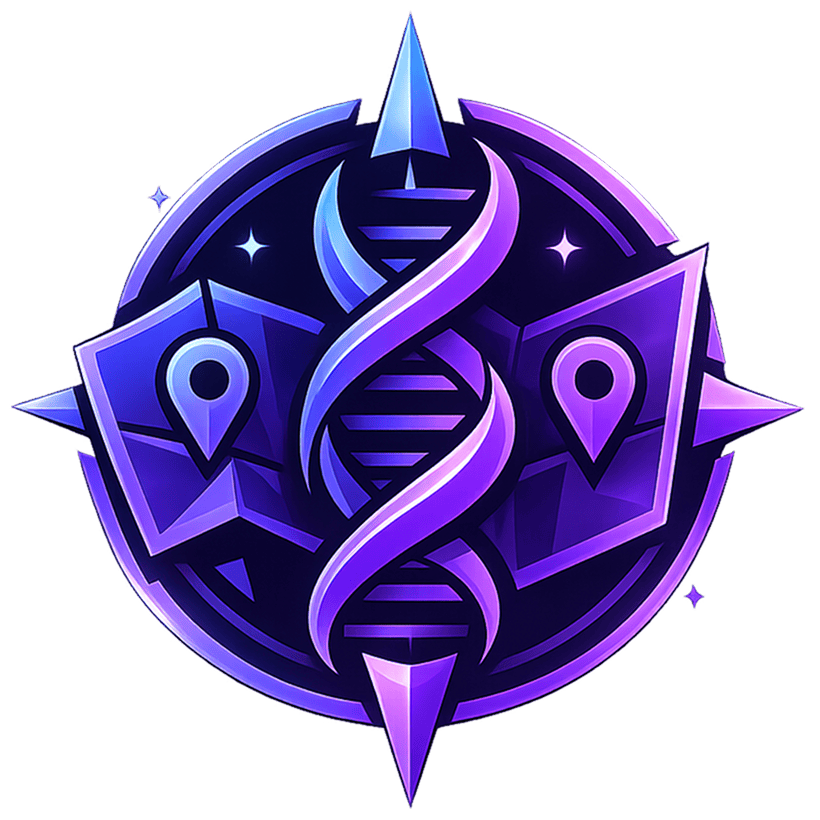

# 🗺️ DNA Interactive - Duet Night Abyss Map



**Carte interactive et ressources communautaires pour Duet Night Abyss**

[](https://nextjs.org/)

[](https://www.typescriptlang.org/)

[](https://tailwindcss.com/)

[](https://bun.sh/)

[](LICENSE)

## 🌟 À propos du projet

**DNA Interactive** est une plateforme web communautaire dédiée au jeu **Duet Night Abyss**. Notre mission est de faciliter l'exploration et la découverte de cet univers fascinant en fournissant des outils interactifs et des ressources utiles aux joueurs.

### ⚠️ Avertissement important

**DNA Interactive n'est en aucun cas affilié ou lié au créateur du jeu Duet Night Abyss.** Ce site est un projet communautaire indépendant créé par des fans pour des fans. Toutes les données et ressources utilisées proviennent de sources publiques et respectent les droits d'auteur et les conditions d'utilisation du jeu original.

Pour plus d'informations sur le jeu officiel, visitez le site d'[Ascencia](https://ascencia.re/).

## ✨ Fonctionnalités

### 🗺️ Carte Interactive
- **6 régions cartographiées** : Explorez tous les recoins du jeu
- **Système de marqueurs** : Marquez automatiquement vos découvertes
- **Filtres avancés** : Catégorisation par type de contenu (coffres, PNJ, points d'intérêt)
- **Interface responsive** : Compatible desktop et mobile
- **Navigation fluide** : Zoom, panoramique et recherche intuitifs

### 📚 Centre de Ressources
- **Page d'accueil** : Présentation du projet et du jeu
- **Support & FAQ** : Aide complète et questions fréquentes
- **Contact** : Formulaire de contact et informations communautaires
- **À propos** : Histoire du projet et équipe

### 🎨 Fonctionnalités Techniques
- **SEO optimisé** : Métadonnées complètes, Open Graph, Twitter Cards
- **Performance** : Images optimisées, lazy loading, PWA-ready
- **Accessibilité** : Navigation ARIA, contraste optimisé
- **Internationalisation** : Support français complet

## 🚀 Démarrage rapide

### Prérequis

- **Node.js** 18+ ou **Bun** 1.2+
- **Git** pour le clonage

### Installation

1. **Clonez le repository**
   ```bash
   git clone https://github.com/your-username/dna-interactive.git
   cd dna-interactive
   ```

2. **Installez les dépendances**
   ```bash
   # Avec Bun (recommandé)
   bun install

   # Ou avec npm
   npm install

   # Ou avec yarn
   yarn install
   ```

3. **Lancez le serveur de développement**
   ```bash
   # Avec Bun
   bun run dev

   # Avec npm
   npm run dev

   # Avec yarn
   yarn dev
   ```

4. **Ouvrez votre navigateur**
   ```
   http://localhost:3000
   ```

## 🛠️ Technologies utilisées

### Framework & Runtime
- **[Next.js 15](https://nextjs.org/)** - Framework React moderne avec App Router
- **[TypeScript](https://www.typescriptlang.org/)** - Typage statique pour JavaScript
- **[Bun](https://bun.sh/)** - Runtime JavaScript ultra-rapide

### UI & Styling
- **[Tailwind CSS](https://tailwindcss.com/)** - Framework CSS utilitaire
- **[Lucide React](https://lucide.dev/)** - Icônes SVG modernes
- **[Leaflet](https://leafletjs.com/)** - Bibliothèque de cartes interactives
- **[React Leaflet](https://react-leaflet.js.org/)** - Intégration React pour Leaflet

### État & Données
- **[Jotai](https://jotai.org/)** - Gestion d'état légère et performante
- **JSON** - Stockage des données de cartes

### SEO & Performance
- **Métadonnées Next.js** - SEO automatique et optimisé
- **Données structurées** - JSON-LD pour les moteurs de recherche
- **Sitemap dynamique** - Indexation automatique
- **Robots.txt** - Instructions pour les crawlers

## 📁 Structure du projet

```
dna-interactive/
├── public/
│   ├── assets/
│   │   ├── ui/           # Éléments d'interface (logos, icônes)
│   │   ├── icons/        # Icônes des catégories
│   │   ├── worldview/    # Images du carrousel
│   │   └── swiper/       # Images supplémentaires
│   ├── manifest.json     # Configuration PWA
│   └── robots.txt        # Instructions SEO
├── src/
│   ├── app/
│   │   ├── layout.tsx    # Layout principal avec métadonnées
│   │   ├── page.tsx      # Page d'accueil
│   │   ├── globals.css   # Styles globaux
│   │   ├── sitemap.ts    # Sitemap dynamique
│   │   ├── map/          # Page de la carte interactive
│   │   ├── contact/      # Page de contact
│   │   ├── support/      # Page de support
│   │   └── about/        # Page à propos
│   ├── components/
│   │   ├── MapComponent.tsx    # Composant carte principal
│   │   ├── StructuredData.tsx  # Données structurées SEO
│   │   └── Providers.tsx       # Providers React
│   ├── lib/
│   │   ├── constants.ts  # Constantes centralisées
│   │   └── store.ts      # État global Jotai
│   └── data/
│       └── mapData.json  # Données des cartes
└── package.json
```

## 🎯 Scripts disponibles

```bash
# Développement
bun run dev          # Serveur de développement
bun run build        # Build de production
bun run start        # Serveur de production
bun run lint         # Vérification ESLint

# Analyse
bun run type-check   # Vérification TypeScript
bun run analyze      # Analyse du bundle (si configuré)
```

## 🌐 Déploiement

### Préparation pour la production

1. **Variables d'environnement**
   ```bash
   # Créez un fichier .env.local
   NEXT_PUBLIC_SITE_URL=https://dna.ascencia.re
   ```

2. **Build de production**
   ```bash
   bun run build
   ```

3. **Déploiement**
   ```bash
   bun run start
   ```

### Plateformes recommandées

- **[Vercel](https://vercel.com/)** - Déploiement automatique depuis Git
- **[Netlify](https://netlify.com/)** - Hébergement moderne
- **[Railway](https://railway.app/)** - Déploiement simple

## 🤝 Contribution

Les contributions sont les bienvenues ! Voici comment participer :

### Pour les développeurs
1. Fork le projet
2. Créez une branche (`git checkout -b feature/AmazingFeature`)
3. Committez vos changements (`git commit -m 'Add some AmazingFeature'`)
4. Push vers la branche (`git push origin feature/AmazingFeature`)
5. Ouvrez une Pull Request

### Pour les contributeurs de contenu
- Signalez des bugs ou des problèmes
- Suggérez de nouvelles fonctionnalités
- Améliorez la documentation
- Partagez vos découvertes dans le jeu

## 📞 Support & Contact

### Communauté
- **Discord** : [Rejoignez notre serveur](https://discord.gg/rTd95UpUEb)
- **Email** : [contact@ascencia.re](mailto:contact@ascencia.re)

### Équipe
- **Créateur** : Ahmed Karim aka PedroKarim
- **Studio** : [Ascencia](https://ascencia.re/)

## 📊 Métriques & Analytics

Le projet utilise des métriques anonymes pour améliorer l'expérience utilisateur. Aucune donnée personnelle n'est collectée.

## 🔒 Sécurité & Confidentialité

- **Aucune donnée utilisateur** stockée côté serveur
- **Préférences** sauvegardées localement uniquement
- **Cookies fonctionnels** uniquement (thème, préférences)
- **Respect RGPD** et des normes de confidentialité

## 📈 Roadmap

### ✅ Version actuelle (1.0.0)
- Carte interactive complète
- Interface responsive
- SEO optimisé
- Support multilingue (FR)

### 🔄 Prochaines fonctionnalités
- [ ] Système de recherche avancé
- [ ] Mode hors-ligne (PWA)
- [ ] Partage de découvertes communautaires
- [ ] API pour intégrations tierces
- [ ] Mode sombre/clair automatique

### 💡 Idées communautaires
- Calculatrice de ressources
- Guide visuel des quêtes
- Base de données des PNJ
- Outil de planification d'exploration

## 🏆 Crédits & Remerciements

### Équipe de développement
- **Ahmed Karim** (PedroKarim) - Créateur & Développeur principal

### Communauté
- Tous les testeurs et contributeurs
- La communauté Duet Night Abyss

### Technologies & Ressources
- [Next.js](https://nextjs.org/) - Framework web
- [Tailwind CSS](https://tailwindcss.com/) - Framework CSS
- [Leaflet](https://leafletjs.com/) - Cartes interactives
- [Lucide](https://lucide.dev/) - Icônes
- [Ascencia](https://ascencia.re/) - Studio créateur du jeu

## 📄 Licence

Ce projet est sous licence **MIT**. Voir le fichier [LICENSE](LICENSE) pour plus de détails.

---

## 🎮 À propos de Duet Night Abyss

**Duet Night Abyss** est un jeu d'aventure captivant développé par [Ascencia](https://ascencia.re/). Le jeu transporte les joueurs dans un monde mystérieux rempli de secrets, de créatures étranges et de trésors cachés.

DNA Interactive a été créé pour enrichir l'expérience de jeu en fournissant des outils communautaires et des ressources utiles aux joueurs.

---

**Fait avec ❤️ pour la communauté Duet Night Abyss**

🌟 *Explorez, découvrez, maîtrisez !* 🌟